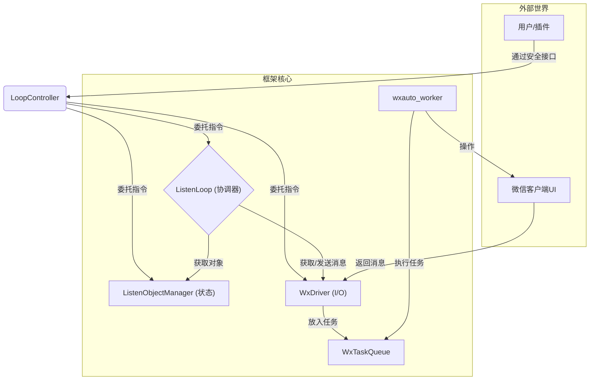

# OWCP - An Advanced, Asynchronous WeChat Robot Framework


**OWCP (Object-oriented Wechat Controller with Plugins)** 是一个基于 `wxauto` 构建的开发友好的、现代化的微信机器人框架。它专为构建稳定、可扩展、易于维护的复杂机器人应用而设计。

---

## ✨ 核心特性

* **异步优先 (Async First)**: 基于 `asyncio` 构建，主循环永远不会被阻塞，确保了高响应性和高性能。
* **高度可扩展 (Extensible)**: 完善的插件系统，允许你通过编写独立的 `Command`, `Filter`, `Responser` 等插件，轻松注入自定义业务逻辑。
* **彻底解耦 (Decoupled)**: 清晰的分层架构，将状态管理 (`Manager`)、微信I/O (`Driver`)、业务逻辑 (`Loop`) 和安全接口 (`Controller`) 彻底分离。
* **并发安全 (Concurrency Safe)**: 独创的任务队列机制 (`WxTaskQueue`)，将所有UI写操作（如发消息、添加监听）串行化，从根本上杜绝了UI自动化中的鼠标冲突问题。
* **面向对象 (Object-Oriented)**: 万物皆对象。每一个监听会话都是一个状态独立、行为清晰的 `ListenObject`。

## 🏛️ 核心架构理念

本框架的核心是“职责分离原则”。我们将一个复杂的机器人拆分为四个协同工作的核心组件：



1.  **ListenObjectManager (状态中心)**: 纯粹的、协程安全的状态管理器，负责在内存中维护所有 `ListenObject` 的集合。
2.  **WxDriver (I/O驱动)**: 封装了所有与 `wxauto` 的底层交互。它不直接执行UI操作，而是将它们打包成任务放入全局队列。
3.  **WxTaskQueue & Worker (安全执行器)**: 全局唯一的任务队列和消费者。它确保所有模拟鼠标的操作都按顺序、一次一个地执行，保证了绝对的UI安全。
4.  **ListenLoop (业务协调器)**: 框架的“大脑”，驱动事件循环，从`Driver`获取消息，从`Manager`获取对象状态，并按顺序执行插件逻辑。
5.  **LoopController (安全门面)**: 为插件提供的一个功能受限的、稳定的API接口，用于控制机器人，而无需暴露框架内部细节。

## 🚀 快速开始

### 1. 安装

```bash
pip install wxauto pyyaml
# 确保你的环境中已安装 wxauto 和 pyyaml
```
将我们最终版本的 `OWCP4.py` 和 `WxTaskQueue.py` 放在你的项目根目录。

### 2. 项目结构

建议采用以下目录结构：
```
your_project/
├── OWCP(version).py
├── WxTaskQueue.py
├── CommonCommands.py
├── CommonFilters.py
├── CommonResponsers.py
└── main.py
```

### 3. 编写主启动文件 `main.py`

这是将所有组件粘合在一起的启动脚本。

```python
# main.py

# 从我们的框架文件中导入所有需要的类
from OWCP(version) import (
    ListenObject, Admin, Group, Friend,ListenObjectManager,
    PluginManager, 
    ListenLoop
)

# 从插件文档中导入插件
from CommonFilters import FilterSYS
from CommonResponsers import PrintMsg

initial_objects = [
    Group("相亲相爱一家人", group_managers={"老婆": 100}),
    Admin("老婆", level=100)
]

# 初始化插件管理器并注册插件
plugin_manager = PluginManager().register_all([
    FilterSYS(), #过滤系统消息
    PrintMsg() #在cmd打印收到的消息
])

# 初始化监听循环
loop = ListenLoop(
    plugin_manager=plugin_manager, #传入插件管理器 
    processing_mode=ProcessingMode.CONCURRENT #设置消息处理为并发模式，保证最大吞吐量
    )

if __name__ == '__main__':
    # 启动监听循环
    loop.launch(initial_objects)
```

### 4. 运行

现在，登录你的PC微信，然后运行主脚本：
```bash
python main.py
```
你将看到机器人启动、连接、同步，并开始监听消息！

### 5. 编写插件

编写插件非常简单，只需要继承 `MsgFilter`,`MsgResponser`等抽象基类,并按照docstring的提示实现 `execute` 方法即可。
例如:

```python
# 命令插件
class PauseAndStop(Command):
    def __init__(self):
        super().__init__(
            description="暂停/停止监听循环",
            scope=CommandScope.ADMIN_DIRECT # 只能由Admin在私聊中触发
        )
    async def execute(self, controller: 'LoopController', driver: 'WxDriver', context: 'CommandContext'):
        if context.admin_level < 1:
            return  # 权限不足
        if context.msg.content == startswith("/"): #自主定义命令触发条件
            if context.msg.content == ("/pause"):
                await controller.pause()
                await driver.quote(context.msg, "*监听循环已暂停*")
            elif context.msg.content == ("/stop"):
                await controller.stop()
                await driver.quote(context.msg, "*监听循环已关闭*")
```

## 部署注意事项

* **Windows Server**: UI自动化依赖于前台窗口。为了防止服务器在无人值守时自动锁屏，请调整系统电源/锁屏策略。

## 贡献

欢迎提交 Pull Request 或 Issue 来帮助我改进框架.

## License

本项目采用 [MIT License](LICENSE)。


---
## OWCP 框架核心API文档
以下是OWCP框架主要类的属性与方法的详细列表，旨在为开发者提供清晰的参考。
### 一、 核心引擎组件
这些类构成了框架的“引擎室”，负责驱动整个应用。
#### `ListenLoop`
**职责**: 框架的“大脑”与总指挥，负责协调所有组件，驱动事件循环，并提供最终的用户启动入口。
| 名称 | 类型 | 描述 |
| :--- | :--- | :--- |
| `__init__(...)` | 方法 | 构造函数。通过 **依赖注入** 接收所有核心组件 (`manager`, `driver`, `plugin_manager`)，并接受可选的运行模式参数。|
| `launch(initial_objects)` | 方法 | **【开发者调用的唯一主入口】**。这是一个 **同步** 方法，封装了所有启动逻辑（连接、同步、运行、异常处理、关闭），让用户无需关心`asyncio`细节，一行代码即可启动机器人。 |
| `run()` (`_run_main_loop`) | `async` 方法 | **（内部核心）** 真正的主事件循环。它周而复始地从`driver`获取消息，并根据设定的处理模式（串行/并发）来调度消息处理。 |
#### `WxDriver`
**职责**: 封装所有与`wxauto`的底层I/O交互。它是框架与微信客户端沟通的唯一桥梁。
| 名称 | 类型 | 描述 |
| :--- | :--- | :--- |
| `__init__(...)` | 方法 | 构造函数。接收 `language` 和 `sending_delay` 等配置。 |
| `wx` | 属性 | `WeChat`实例。在`connect()`成功后被赋值，代表已连接的微信客户端。 |
| `sending_delay` | 属性 | 每个UI写操作之间的最小延迟，确保稳定性。 |
| `connect()` | `async` 方法 | **（阻塞操作）** 连接到PC微信客户端。必须在所有任务开始前完成。 |
| `get_listen_messages()` | `async` 方法 | **（只读操作）** 从微信获取所有被监听对象的新消息。这是一个可以直接执行的UI读操作。 |
| `sync_object_to_wx(obj)` | `async` 方法 | **（入队任务）** 将一个`ListenObject`的状态（如是否存图）同步到`wxauto`的监听列表。 |
| `remove_object_from_wx(name)` | `async` 方法 | **（入队任务）** 从`wxauto`的监听列表中移除一个对象。 |
| `send_text(...)` | `async` 方法 | **（入队任务）** 请求发送一条文本消息。 |
| `send_file(...)` | `async` 方法 | **（入队任务）** 请求发送一个文件。 |
#### `ListenObjectManager`
**职责**: 纯粹的、协程安全的状态中心。负责在内存中统一管理所有`ListenObject`的状态。
| 名称 | 类型 | 描述 |
| :--- | :--- | :--- |
| `__init__()` | 方法 | 初始化一个内部字典和用于保证协程安全的`asyncio.Lock`。 |
| `setup_initial_objects(objects)` | `async` 方法 | 使用初始对象列表填充管理器，此操作会清空旧数据。 |
| `add(obj)` | `async` 方法 | 安全地添加或覆盖一个`ListenObject`。 |
| `remove(name)` | `async` 方法 | 根据名称安全地移除一个`ListenObject`。 |
| `get(name)` | `async` 方法 | 根据名称安全地获取一个`ListenObject`实例。 |
| `get_all_dict()` | `async` 方法 | 安全地获取当前所有`ListenObject`的字典拷贝。 |
#### `LoopController`
**职责**: 提供给插件的、功能受限的“安全门面”。插件通过它来与框架核心交互，实现动态控制。
| 名称 | 类型 | 描述 |
| :--- | :--- | :--- |
| `pause_loop()` | `async` 方法 | 指令接口：暂停整个机器人的主循环。 |
| `resume_loop()` | `async` 方法 | 指令接口：恢复整个机器人的主循环。 |
| `end_loop()` | `async` 方法 | 指令接口：安全地结束整个机器人程序。 |
| `pause_listen_object(name)` | `async` 方法 | 指令接口：暂停对指定名称对象的监听。 |
| `resume_listen_object(name)` | `async` 方法 | 指令接口：恢复对指定名称对象的监听。 |
| `add_listen_object(obj)` | `async` 方法 | 指令接口：安全地新增或更新一个监听对象（状态和微信I/O同步进行）。 |
| `remove_listen_object(name)` | `async` 方法 | 指令接口：安全地移除一个监听对象。 |
| `pause_plugin_by_name(name)` | `async` 方法 | 指令接口：暂停指定名称的插件。 |
| `resume_plugin_by_name(name)` | `async` 方法 | 指令接口：恢复指定名称的插件。 |
### 二、 数据模型
这些类定义了框架操作的核心数据结构。
#### `ListenObject` (抽象基类)
**职责**: 所有被监听对象（管理员、群、好友）的通用抽象。
| 名称 | 类型 | 描述 |
| :--- | :--- | :--- |
| `name` | 属性 | 对象的唯一名称（通常是微信备注名）。 |
| `type` | 属性 (只读) | 对象的类型 (`ListenObjectType`枚举)。 |
| `messages` | 属性 | `MessageHistory`实例，存储--
## OWCP 框架核心API文档
以下是OWCP框架主要类的属性与方法的详细列表，旨在为开发者提供清晰的参考。
### 一、 核心引擎组件
这些类构成了框架的“引擎室”，负责驱动整个应用。
#### `ListenLoop`
**职责**: 框架的“大脑”与总指挥，负责协调所有组件，驱动事件循环，并提供最终的用户启动入口。
| 名称 | 类型 | 描述 |
| :--- | :--- | :--- |
| `__init__(...)` | 方法 | 构造函数。通过 **依赖注入** 接收所有核心组件 (`manager`, `driver`, `plugin_manager`)，并接受可选的运行模式参数。|
| `launch(initial_objects)` | 方法 | **【开发者调用的唯一主入口】**。这是一个 **同步** 方法，封装了所有启动逻辑（连接、同步、运行、异常处理、关闭），让用户无需关心`asyncio`细节，一行代码即可启动机器人。 |
| `run()` (`_run_main_loop`) | `async` 方法 | **（内部核心）** 真正的主事件循环。它周而复始地从`driver`获取消息，并根据设定的处理模式（串行/并发）来调度消息处理。 |
#### `WxDriver`
**职责**: 封装所有与`wxauto`的底层I/O交互。它是框架与微信客户端沟通的唯一桥梁。
| 名称 | 类型 | 描述 |
| :--- | :--- | :--- |
| `__init__(...)` | 方法 | 构造函数。接收 `language` 和 `sending_delay` 等配置。 |
| `wx` | 属性 | `WeChat`实例。在`connect()`成功后被赋值，代表已连接的微信客户端。 |
| `sending_delay` | 属性 | 每个UI写操作之间的最小延迟，确保稳定性。 |
| `connect()` | `async` 方法 | **（阻塞操作）** 连接到PC微信客户端。必须在所有任务开始前完成。 |
| `get_listen_messages()` | `async` 方法 | **（只读操作）** 从微信获取所有被监听对象的新消息。这是一个可以直接执行的UI读操作。 |
| `sync_object_to_wx(obj)` | `async` 方法 | **（入队任务）** 将一个`ListenObject`的状态（如是否存图）同步到`wxauto`的监听列表。 |
| `remove_object_from_wx(name)` | `async` 方法 | **（入队任务）** 从`wxauto`的监听列表中移除一个对象。 |
| `send_text(...)` | `async` 方法 | **（入队任务）** 请求发送一条文本消息。 |
| `send_file(...)` | `async` 方法 | **（入队任务）** 请求发送一个文件。 |
#### `ListenObjectManager`
**职责**: 纯粹的、协程安全的状态中心。负责在内存中统一管理所有`ListenObject`的状态。
| 名称 | 类型 | 描述 |
| :--- | :--- | :--- |
| `__init__()` | 方法 | 初始化一个内部字典和用于保证协程安全的`asyncio.Lock`。 |
| `setup_initial_objects(objects)` | `async` 方法 | 使用初始对象列表填充管理器，此操作会清空旧数据。 |
| `add(obj)` | `async` 方法 | 安全地添加或覆盖一个`ListenObject`。 |
| `remove(name)` | `async` 方法 | 根据名称安全地移除一个`ListenObject`。 |
| `get(name)` | `async` 方法 | 根据名称安全地获取一个`ListenObject`实例。 |
| `get_all_dict()` | `async` 方法 | 安全地获取当前所有`ListenObject`的字典拷贝。 |
#### `LoopController`
**职责**: 提供给插件的、功能受限的“安全门面”。插件通过它来与框架核心交互，实现动态控制。
| 名称 | 类型 | 描述 |
| :--- | :--- | :--- |
| `pause_loop()` | `async` 方法 | 指令接口：暂停整个机器人的主循环。 |
| `resume_loop()` | `async` 方法 | 指令接口：恢复整个机器人的主循环。 |
| `end_loop()` | `async` 方法 | 指令接口：安全地结束整个机器人程序。 |
| `pause_listen_object(name)` | `async` 方法 | 指令接口：暂停对指定名称对象的监听。 |
| `resume_listen_object(name)` | `async` 方法 | 指令接口：恢复对指定名称对象的监听。 |
| `add_listen_object(obj)` | `async` 方法 | 指令接口：安全地新增或更新一个监听对象（状态和微信I/O同步进行）。 |
| `remove_listen_object(name)` | `async` 方法 | 指令接口：安全地移除一个监听对象。 |
| `pause_plugin_by_name(name)` | `async` 方法 | 指令接口：暂停指定名称的插件。 |
| `resume_plugin_by_name(name)` | `async` 方法 | 指令接口：恢复指定名称的插件。 |
### 二、 数据模型
这些类定义了框架操作的核心数据结构。
#### `ListenObject` (抽象基类)
**职责**: 所有被监听对象（管理员、群、好友）的通用抽象。
| 名称 | 类型 | 描述 |
| :--- | :--- | :--- |
| `name` | 属性 | 对象的唯一名称（通常是微信备注名）。 |
| `type` | 属性 (只读) | 对象的类型 (`ListenObjectType`枚举)。 |
| `messages` | 属性 | `MessageHistory`实例，存储该对象的消息历史。 |
| `savepic`\<br\>`savevoice`\<br\>`savefile` | 属性 (只读) | 布尔值，标识是否保存特定类型的媒体文件。 |
| `max_msgs` | 属性 (读/写) | 该对象能存储的最大历史消息数。 |
| `add_msg(msg)` | 方法 | 向消息历史中添加一条消息。 |
| `clear_msg(num)` | 方法 | 清除指定数量的旧消息。 |
| `get_messages()` | 方法 | 获取所有历史消息的列表拷贝。 |
| `pause()` / `resume()` | 方法 | 暂停/恢复对该对象的处理（在主循环中生效）。 |
| \`is\_paused`is_paused()` | 方法 | 检查该对象是否处于暂停状态。 |
#### `Admin` / `Group` / `Friend`
**职责**: `ListenObject`的具体实现。
| 类 | 新增属性/方法 | 描述 |
| :--- | :--- | :--- |
| \*\***`Admin`** | `level` (属性) | 管理员的权限等级，供`Command`插件内部逻辑使用。 |
| \**`Group`** | `is_manager(name)` | 判断指定用户是否为本群管理员。 |
| | \`get\_manager\_level(name)`get_manager_level(name)` | 获取指定群管理员的权限等级。 |
| | `add_group_manager(name, level)`| 添加或更新一个群管理员。 |
| | `remove_group_manager(name)` | 移除一个群管理员。 |
| **`Friend`** | - | 无新增属性或方法，是`ListenObject`的直接实现。 |
#### `MessageHistory`
**职责**: 一个基于`deque`的高效、定长的消息存储容器。
| 名称 | 类型 | 描述 |
| :--- | :--- | :--- |
| `max_size` | 属性 (读/写) | 队列的最大容量。 |
| `add(msg)` | 方法 | 添加一条消息，如果队列已满，最老的消息会自动被挤出。 |
| `get_all()` | 方法 | 以列表形式返回当前所有消息的拷贝。 |
| `clear(num)` | 方法 | 从队列头部移除指定数量的消息。 |
| `__len__()` | 方法 | 返回当前存储的消息数量。 |
### 三、 插件系统
这是框架扩展性的核心，定义了用户如何注入自己的业务逻辑。
#### `PluginManager`
**职责**: 所有插件的“注册与管理中心”。
| 名称 | 类型 | 描述 |
| :--- | :--- | :--- |
| `register(*plugins)` | 方法 | 注册一个或多个插件实例。 |
| `register_all(plugins)` | 方法 | `register`的语法糖，方便地从一个列表中注册所有插件。 |
| `unregister(name)` | 方法 | 根据唯一名称安全地注销一个插件。 |
| `get_plugin(name)` | 方法 | 根据唯一名称获取插件实例，供`LoopController`使用。 |
#### 插件基类 (ABCs)
**职责**: 定义了不同类型插件必须遵守的“契约”，主要是`execute`方法的签名。
| 类 | 核心方法 `execute(...)` 签名 | 描述 |
| :--- | :--- | :--- |
| \`Opening`OpeningUp` | `execute(obj) -> str` | **（同步）** 在机器人启动时对每个对象执行，返回问候语。 |
| `EndingUp` | `execute(obj) -> str` | **（同步）** 在机器人关闭时对每个对象执行，返回告别语。 |
| `Command` | `async execute(controller, driver, context)` | **（异步）** 响应管理员或群管的命令。`context`包含所有权限和消息信息。 |
| `MsgFilter` | `execute(obj, msg) -> bool` | **（同步）** 消息过滤器。返回`False`则该消息被拦截，不再继续处理。 |
| `MsgResponser` | \`async execute(driver`async execute(driver, obj, msg)` | **（异步）** 响应普通消息的核心逻辑，如关键词回复、调用AI等。 |
#### `CommandContext` (`NamedTuple`)
**职责**: 在执行`Command`插件时，作为一个只读的数据容器，封装了所有必要的上下文信息。
| 字段名 | 类型 | 描述 |
| :--- | :--- | :--- |
| `is_admin` | `bool` | 消息来源是否为全局`Admin`。 |
| `admin_level` | `Optional[int]` | `Admin`的权限等级。 |
| `is_group_manager` | `bool` | 消息发送者是否为当前群的`GroupManager`。 |
| `group_manager_level` | `Optional[int]` | `GroupManager`的群内权限等级。 |
| `source_object` | `ListenObject` | 消息来源的对象实例（`Admin`或`Group`）。 |
| `message` | `Message` | 触发命令的原始消息对象。 |
-----
